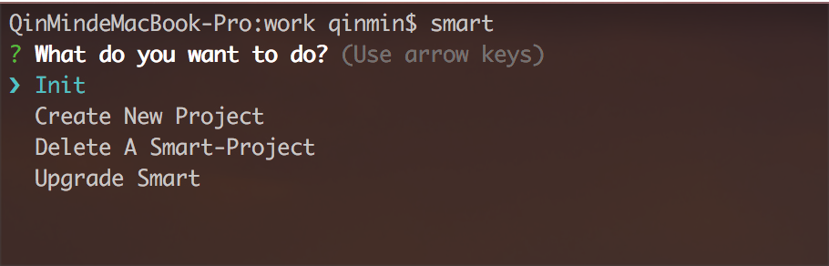

#### 描述
**smart** 是基于webpack用于前端开发和构建为一体的快速职能工具。目前主要用在SPA项目上。

> 提示: 暂时不建议用在多页面项目上，有时间优化后可在用。

**smart** 有能力给你提供一个可引导的工作步骤，它知道你是不是要创建一个新的项目，还是要去开发调试或者打包项目。

对不熟悉使用CLI命令的使用者，提供了可直观的命令操作界面，同时对于不熟悉 **smart** 的使用者来说减少了一些不必要的时间开销。

**smart** 对ES6有更好的支持


## 特色

- 职能的CLI命令
- 简单的配置
- 多个项目模式
- 高效的创建页面
- 自动匹配新页面路由
- 根据启动的环境决定拆封页面代码块
- 支持 mockjs 和 proxy

## 安装
1. npm （稍后发布）

	 > 建议安装到本地
	
	 安装到本地
	 
	 ````
	 // 打开终端
	 // 命令 ‘cd’ 进入到你要安装到目录
	 
	 npm install boy-smart --save-dev
	 
	 // 然后进入到boy-smart目录
	 // 使用下面命令映射到全局，这样可以在任何有效的目录调用 'smart' 命令
	 
	 npm link 或者 npm link boy-smart
	 ````
	 
	 安装到全局
	 
	 ````
	 npm install boy-smart -g
	 ````
 
2. git

	````
	// 同上面一样，进入到你安装的目录位置

	git clone git@github.com:09boy/boy-smart.git
	
	// 进入到 boy-smart 安装目录, 使用下面命令映射到全局，方便全局使用 smart 命令
	
	npm link boy-smart
	
	````
3. yarn（稍后发布）

	> 稍后提供 yarn

## 支持的项目模式
- normal
- react
- vue


>  当你创建一个新项目的时候可用，如果不存在，smart 应该会给出提示，如果没有那是测试疏忽了。😄

##### normal 项目
- 这只是一个普通不能在普通的项目，完全由你去开发，可基于 backbone 做 SPA 应用项目，也可以完全当作学习新知识去使用。
- react 和 vue 就是在这基础上做的封装，所以你完全也可以用这种模式去整合你自己独有的应用。
- 下面有demo提供, 这里你只需要了解有这几个模式

> 不给指定 -m, --mode 参数，默认将创建一个普通项目
	
````
// 初始化一个项目
	
smart init
	
// 或者 参数简写
	
smart init -m normal
	
// 参数全写
smart init --mode normal
````

##### react 项目
基于 react + react-router-dom + redux 这些为依赖的项目

	````
	// 初始化一个 react 项目
	
	smart init -m react
	
	// 同上 normal
	smart init --mode react
	````

vue 项目
基于vue + vuex + vue-router 这些为依赖的项目

	````
	// 初始化一个 vue 项目
	
	smart init -m vue
	
	// 同上 normal
	smart init --mode vue
	````

## CLI 命令

命令|参数|参数值|说明|使用
---|---|---|---|---
init \<app-name> | 简写: -m<br>全称: --mode | normal, react, vue | 1. \<app-name>是需要给一个要创建的项目名称;<br>2. 参数缺省值: normal | smart init newapp
install | | | 1. 初始化完成后，方可用，否则是一个无效的命令, smart自己知道; <br/>2. 如果有必要，安装之前你可以修改默认的配置文件中的值 | smart install
create \<app-name> | | | 1. \<app-name>是需要给一个要创建的项目名称; <br>2. 创建一个 normal 项目并安装所需要的依赖包，相当于 init 和 install 的结合 | smart create newapp
create-react \<app-name> | | | 同上(create), 只不过这是一个 react 项目| smart create-react newapp
create-vue \<app-name> | | | 同上(create) | smart create-vue newapp
start |-p, --port<br>-h, --host | 缺省值查看配置文件 |1. 用于开发调试;<br>2. 只有在有效的smart项目中才可以用，smart 自己知道 |默认端口: smart start;<br>指定端口: smart start -p 6666
page \<names> |  | | 1. \<names> 要创建的页面名称，多个页面可以用空格隔开;<br>2. 自动转换文件名: 首字母在文件夹中替换成小写，类名是大写;<br>3. 例如创建两个页面: smart page about Work, 文件夹名为[about, work], 类名为[AboutPage, WorkPage] | 创建一个页面: smart page about;<br>创建多个页面: smart page about work contact
page-child<br>\<parent-folder-name><names> | | | 1. <parent-folder-name> 是指定要创建的子页面的已经存在的父目录名称，一次只能指定一个父目录;<br>2. <names>是要创建的子页面，可以有多个,和 page命令一样 | 在about页面下创建一个news子页面：<br>smart page-child about news;<br>多个子页面：<br>smart page-child about child1 child2 child3
component \<names>| | | 同上(page) | 同上(page)
build | dev<br>pro<br>gray<br>release| 无值，只需要指定参数名即可 | 1. dev 不要缩打包;<br>2. pro 压缩打包，包含console;<br>3. 基本和pro一样，依赖项目模式, 可忽略;<br>4. release 清除所有 console 和 died code, 不包含source-map, 正式生产环境用;<br> 无参数和参数错误有提示 |1. smart build dev<br>2. smart build pro<br>3.smart build gray<br>4. smart build release
server | -p, --port<br>-h, --host | 缺省值配置文件中的值 | 1. 启动一个 node 服务;<br>2. 暂时依赖配置文件中的 build_dir（目录名称） 值 | smart server
del \<app-name> | | | 1. 如果你要删除一个已经存在 smart 项目，进入到要删除项目的父层;<br>2. 强烈建议使用这个命令去删除 smart 项目, 不要直接去删除文件夹 | smart del myapp
upgrade | | | 更新 smart | smart upgrade
eslint|||1. 校验代码;<br>2. 开发中...|
test|||2. 单元测试;<br>2. 开发中...|

> 如果你输入 smart 这个命令会出现下面情况:

````
// 终端致输入下面命令

smart 
````
如果当前目录不是一个 smart 目录，将出现下面界面：



如果当前目录是一个 smart 目录，将会是这样的界面:


> 上面可能对于新手有点帮助, 会一步一步根据提示完成操作

## 配置文件与项目结构

> 可通过 smart.config.yml 文件去修改相应的参数值

基本机构是这样的

````
project dir 					项目目录
│
│
├── dist 						打包代码后输入目录
│
├── src 						开发入口目录
│   │
│   ├── assets					静态资源目录 css, image fonts svg ...
│   │   ├── images
│   │   ├── fonts
│   │   ├── other statics
│   │
│   ├── components				可重复利用，封装的代码目录
│   │
│   │
│   ├── pages 					页面管理目录
│   │   ├── index.js
│   │   ├── router.config.js
│   │   ├── home_dir
│   │   ├── about_dir
│   │   ├── ...otehr pages
│   │
│   ├── utils					放一些tools代码, 比如 constant, request(ajax)
│   │
│   │.......................... 还有写配置文件都会放在根目录下
````

然后呢各个项目模式会有些不同，但上面是基本不会变的。

 [详情-有时间再写](strcture.detail.md)

## 项目简要说明以及DEMO

###Normal Project
**normal 项目，暂时没有集成任何针对性的代码库或者插件，出于下面几个原因:**

1. 有针对性，就有了限制的范围。对于普通项目的来说，未必有伸展行
2. 对于 normal 项目，smart就是一个给你提供干净的纸和笔，你根据需要自己去添加笔触
3. 重要的是自己几乎用不到普通模式，写这个文档就是给自己一个学习交代。
		
**关于创建页面和组件的问题**
	
1. 不像react, vue 针对性的项目，可以减少一些手动添加样板代码的操作
2. smart 通过检索一个外部提供的固定名称的样本文件去解决这个问题:
	- 样本文件是放在项目根目录名字为 templates 的文件夹，里面包含 page 和 component 两个文件夹。
	- 这两个文件夹里面必须包含 index.js 或者 index.jsx。
	- 如果没有提供: page 只会创建一个包含有 index.js 和 style.scss 两个空白文件的文件夹。
	- 每次创建一个新项目，默认会提供这个样本文件（可在配置文件中修改），如果你想手动创建，请删除 templates 文件夹或者在配置文件中关闭这个选项。如果只想用page那么删除component这个就可以了。
	- 当然你还可以不用 page 和 component 命令去创建页面和组件，手动添加就好了，如果你觉得方便
		
		> 因为未知模版类型，所以只会单纯的复制模版文件！同样也不会动态帮你拆封页面代码，因为无法感知到你用什么样第三方类库去整合，你可以用import(path) 或 require.ensure 实现按需加载。
			
**关于 Hot Module Replacement**
	
> 不像 react 和 vue 项目都有现成的 loader 去处理， 所以对于普通项目来说，你可以先去[webpack官网](https://webpack.js.org/api/hot-module-replacement/), 了解下相应的知识，这对你理解很有帮助。<br> 其实对于任何文件都可以做到HMR。<br>时间宽裕可以研究再写一个普通项目的HMR插件。<br>下面是smart 创建的normal 项目，用backbone和jquery做了一个SPA 例子，实现了HMR，和页面代码拆封，但没有实现按需加载(通过路由侦听路由实现即可)，下面是地址：
	
[normal-project-demo]()

###React Project

- 创建新页面后会把页面自动绑定到路由配置文件，所以你只需要写一个nav组件去调用数据渲染成你需要的导航样式即可。
		
	> 如果页面名称为home，默认路由会 ‘／’, 而不是 '/home'
	
	>创建子页面后，smart 只把子页面路径放到了router.config.js文件中，并没有添加到相应的父级下，需要你手动添加。关于子路由这个问题很头疼，没有想到有什么好方式，可以勉去这样的操作。
	
- 按需加载页面，通常我们会用 [bundle-loader](https://github.com/webpack-contrib/bundle-loader) 实现拆封代码块。 而 smart 不需要你关注这些，你完全就按普通导入页面即可：
		
	* **使用 bundle-loader 是这样的**
	
		````
		// 比如要导入 About 页面到路由文件
		// name参数可以随意
	
		import AboutPage from 'bundle-loader?name=about!./about';
		````	
	* **smart 是这样的**
		
		````
		// 比如要导入 About 页面到路由文件
		// smart 生成的name参数会用文件夹名称，因为这个一点也不重要对于绝大数项目来说，完全可以忽略
		
		import AboutPage from './about';
		````
		>你会发现在 development 模式下并没有按需加载，但是你打包后发现代码已经拆封实现按需加载，重要的是你不需要做任何改变， 这完全得益于本人自己写了一个 [loader](https://webpack.js.org/api/loaders/#this-loadmodule) 去实现这些. 目的就是少写一些样本代码, 起初是因为现有的 loader 出现各种各样的问题，找问题花了本人很长时间，最后无奈自己写一个吧.<br>注意事项： 本应该没有的，但是要不要灵活的根据配置文件去做匹配还没有想好。正常情况下你使用默认的 pages目录管理你的页面（所有的页面都是在 pages 目录下），异步加载会匹配这个目录下的所有子目录中的index.js ／ index.jsx 文件作为页面入口文件。 而 pages 目录名称可以根据配置文件生成你要想的任何名称。<br>解决办法：如果你不想用 pages管理所有页面，改为别的名称，那么你可以按照bundle-loader写样本代码那样引入页面文件, 不过这里需要使用 async-loader (这个也是本人写的; 这两个loader 暂时没有发布到 npm 上)用法和bundle-loader 完全一样。async-loader内置到 smart 中: import AboutPage from 'async-loader?name=about!./about;<br>后续会升级，应该是完全不用关心才对. 
	
- 新建页面后，你不用去手动去创建action, selector, reducer 的文件然后在关联到页面上，这些 smart 已经给你做好了。
	>正常情况下，我们的 actions, selectors, reducers的这些文件都放在各自独立的文件下并且它们被放在一个公共的目录下去管理， 比如这样：app 目录下管理这些

	````
	├── app
	│   ├── actons
	│   │   ├── index.js
	│   │   ├── org.js
	│   │   ├── acount.js
	│   │   ├── etc.js
	│   ├── selectors
	│   │   ├── home.js
	│   │   ├── about.js
	│   │   ├── work.js
	│   │   ├── etc.js
		 ... 省略
	````
	>这样管理很好，如果是个人写整个业务也没有什么大问题。但是多人合作问题还是狠突出的，体现如下：<br>1. 大多数情况下，这些 actions, reducers 和 selector 都是私有和具体页面的业务绑定的，集中放在这里各有利弊吧，相当于没说。<br>2. 而这些肯定会有 common 的代码需要复用，随之代码越来越多，多人合作并不是一开始就熟悉整个产品模式，完全有可能是中间插进来的新人来一起写，这就会出现 common 没有被复用的情况，原因也就不说了吧。<br>3. 从文件操作[添加，修改，删除]上来说，也比把所有的都集中在一个地方上操作要方便的多。
		
		
	**smart** 决定不用这种结构管理它们，(但smart灵活的给你留下全局管理所有store数据地方，那就是你完全忽略各个page目录下的redux，😂),而是把私有的放在各自的业务页面目录下，比如 about 页面:
		
		````
		├── pages
		│   ├── home
		│   │   ├── index.js
		│   │   ├── redux
		│   │   │   ├── action.js
		│   │   │   ├── reducer.js
		│   │   │   ├── selector.js
			 ... 省略
		````
	把 common代码放在 app 下去管理。
		
- 创建组件也一样，会自动绑定到组件入口文件，你不用手动去管理，写完代码在别的地方直接引用即可。
	
[react-project-demo]()

###Vue Porject
	
结构和 react project 大致相同, 存在很多细节的区别，这是因为两者(vuex & redux)之间不同之处产生的，更详细请看demo实例。 
	

	
创建新页面自动绑定到路由配置文件，你只需要关注根据需求如何使用数据就行。
	
> 如果页面名称为home，默认路由会 ‘／’, 而不是 '/home'
	
自动关联本地数据到store，更方便的去操作和关注私有数据。
	
	
...更多细节有时间补充上
	
	
[vue-project-demo]()
	
## MOCK 和 PROXY
> 可通过 mock.js 文件配置

**配置结构**

- 由数组包含着item对象组成: [ {}, ...items ]
- item 结构: {path, method, data, filename, proxyOption} 拥有这些合法key

| 属性 | 属性值 | 说明 |
---|---|---|---
| path | /api/login | 请求的 api 地址 |
| method| get, post, delete, ...| 任何express合法的请求方式 |
| data | 响应数据 response  | 1. {per_page: 1, total: 10, data: [...items]}<br>2. 可以用mockjs模拟 |
| filename | .js 文件 | 1. 用 module.exports 语法导出你的响应数据;<br>2. 如果存在 fielname 将忽略 data属性;<br>3.  如果懒惰用mockjs模拟复杂的数据机构并且有现成的结构数据可供拷贝，你可以直接保存到一个js文件中并导出
| proxyOption | 依赖 http-proxy-middleware node插件 | 1. 参考地址 [http-proxy-middleware](github.com/chimurai/http-proxy-middleware);<br>2. 如果存在将忽略**path**属性以外的所有属性|

````

// 三种方式
[
	{ // 使用 mokejs 用data属性或者自定义数据
		path: '/api/login',
		method: 'post',
		data: {
			id: '@id',
			name: '@cname',
			data: '@date
		}
	},
	{ // 使用外部 js 文件导出的模块数据
		path: '/api/orgs',
		method: 'get',
		filename: '/your_dir_name/orgs.js'
	},
	{ // 使用代理
		proxyOption: { // ref: github.com/chimurai/http-proxy-middleware
			...config
		},
		path: '/api/acounts'
	}
]
````

## 问题
1. 局限性： 
	- 本人技术问题
	- 拥有的空闲学习时间
2. smart 是本人在空闲时间学习完成的产品
3. 有很多想法，还没有实现，需要时间一步一步完成, 比如：
	- 头等大事就是怎么样能即简单又只操作一步命令就可以完成更好的构建优化, 包括官方文档和找到资料都是需要2步
	- 更友好的交互模式体验
	- 提供接口让你自己配制专有的CLI，自动生成
	- 别的次重要的东西

4. smart 使用可能出现的问题, (精力有限)整理中...

**Issues**: [https://github.com/09boy/boy-smart/issues](https://github.com/09boy/boy-smart/issues)